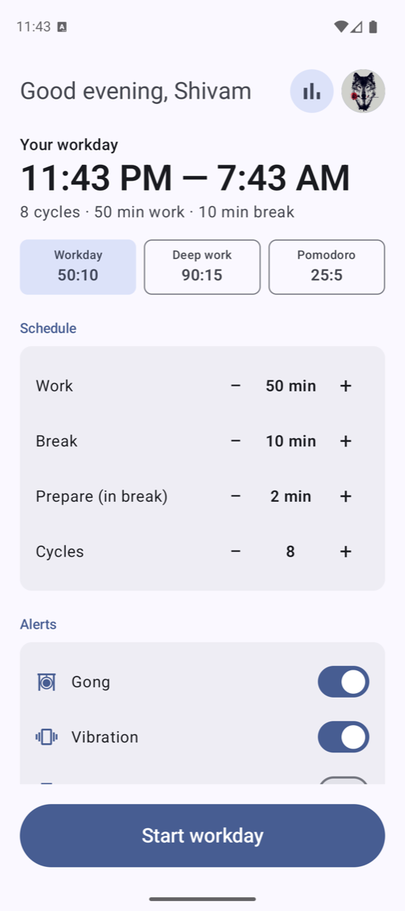
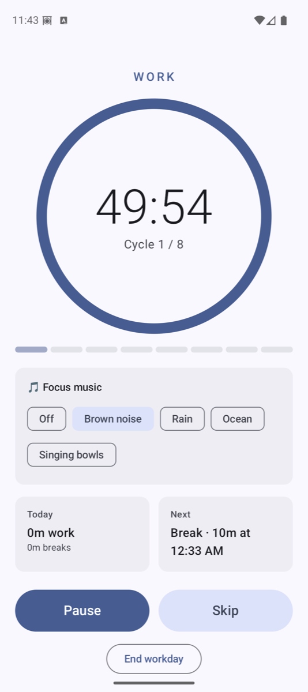
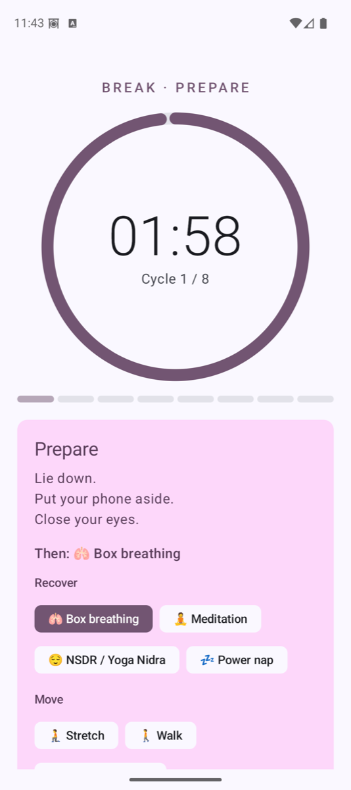
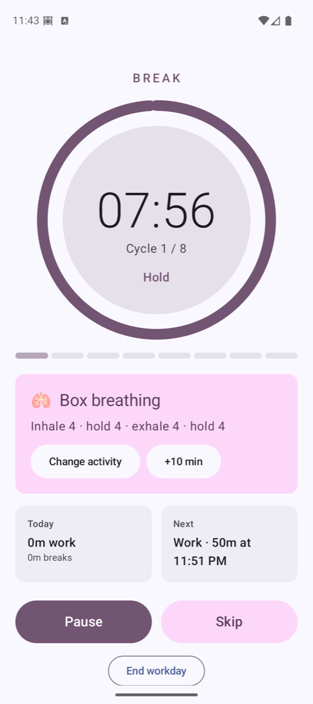
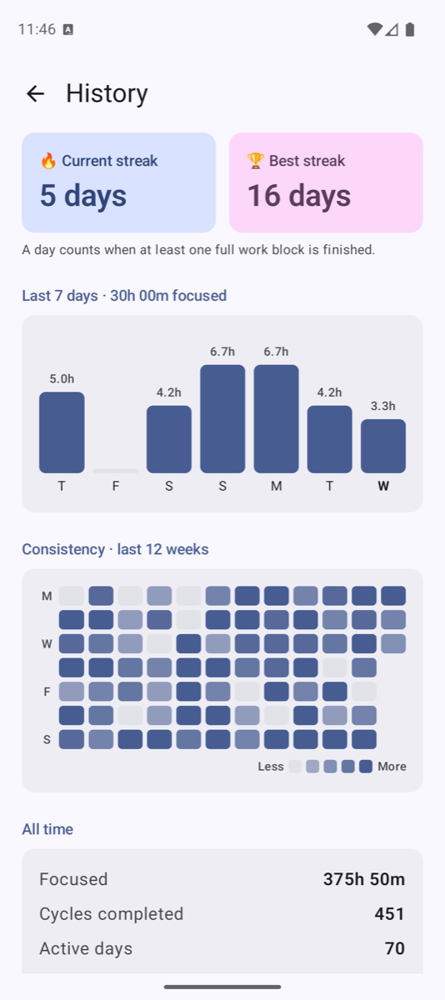
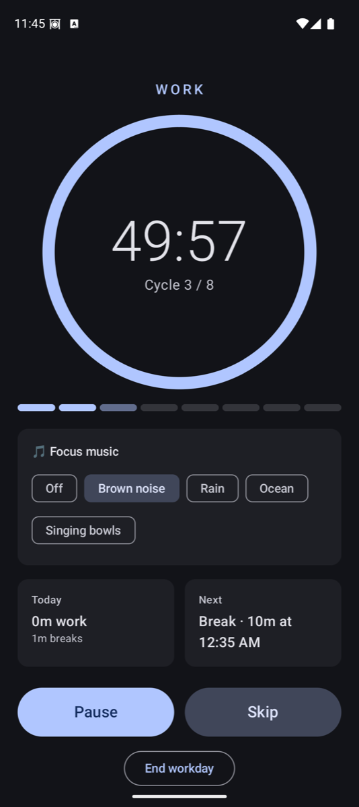
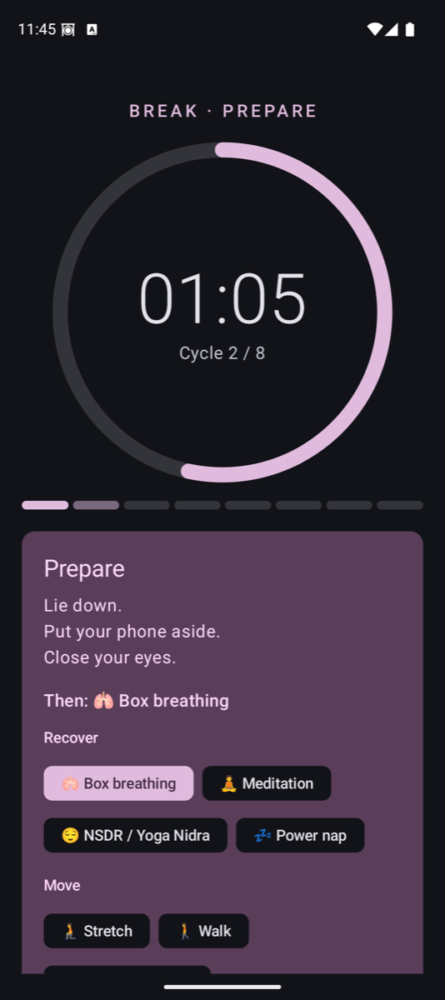
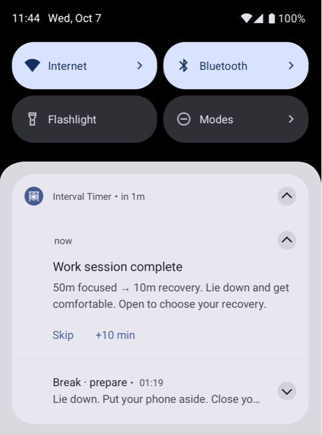

# Interval Timer

A low-power workday timer for Android (built for the Pixel 10 / Android 16): start it once in the
morning, put the phone away, and it runs **8 × (50 min work + 10 min break)** on its own.

- **Gong + vibration** at every transition (single gong → break, double → work, long → day done)
- **Setup is just the schedule** (presets 50:10, 90:15, 25:5) and alerts; everything else is
  decided while the timer runs
- **Breaks start with a 2-min prepare phase**; on the break screen you choose the activity
  (box breathing, meditation, NSDR, power nap, stretch, walk, eye reset, hydrate, ambient, silence)
  and can make it a **long break** (+10 min each tap, also from the notification); the rest of
  the day shifts later
- **Focus music** is picked on the work screen (brown noise, rain, ocean, singing bowls) and
  keeps playing with the screen off
- **Actionable notification** with countdown, Pause and Skip — no need to open the app
- **Restart-proof**: phases are absolute timestamps, rebuilt after reboot
- **History & streaks**: current/best streak, last-7-days focus chart, 12-week consistency heatmap,
  all-time totals. Time is what you actually spent (skips and pauses don't inflate it); a day
  counts toward the streak once one full work block is finished
- **Google account + Drive sync** (optional): sign in from the avatar on the home screen; history
  syncs to your Drive's private app folder (`drive.appdata`, invisible to you and other apps) and
  merges across phones. Without sign-in it all stays local; Android's built-in Google backup
  still covers settings and history
- **Auto-update** from GitHub Releases

## Screenshots

| Home | Work + focus music | Break · prepare | Box breathing |
|:-:|:-:|:-:|:-:|
|  |  |  |  |

| History (sample data) | Dark: work | Dark: break | Phase-change notification |
|:-:|:-:|:-:|:-:|
|  |  |  |  |

Light and dark follow the system theme, with Material You colours from the wallpaper.

## How it stays light

No background ticking. Each phase end is one `AlarmManager` exact alarm; the notification shows
a system-rendered countdown. A foreground service exists only while audio is playing.

## Resources

Audio is **not bundled in the APK**. [`resources/`](resources) holds the sounds and
`manifest.json`; the app downloads them from this repo on first launch and caches them offline.
Sounds are synthesized by [`tools/gen_sounds.py`](tools/gen_sounds.py). To add a sound, drop a file
in `resources/` and add an entry to `manifest.json` (`"loop": true` makes it selectable as music).

## Google Drive sync setup (one-time, Google Cloud Console)

1. Enable **Google Drive API** for the project.
2. **OAuth consent screen**: External, status *Testing*, add your Gmail as a test user, add scope
   `https://www.googleapis.com/auth/drive.appdata`.
3. **Credentials → OAuth client ID → Android**, package `com.shivam1410.intervaltimer`:
   - release key SHA-1 `E5:3B:B2:7B:1B:5B:28:1D:BC:17:A0:56:5E:4E:99:95:66:49:5A:85`
   - (optional, for debug builds) a second client with the debug key SHA-1 from
     `keytool -list -v -keystore ~/.android/debug.keystore -storepass android`

No Web client or API key is needed: the app uses Google's `AuthorizationClient`, which returns the
Drive token and your name/photo in one consent.

## Build & release

```bash
./gradlew testDebugUnitTest assembleDebug
scripts/release.sh 1.0.1 "What changed"
```

`release.sh` bumps `VERSION_NAME`, builds a signed APK, tags, pushes and creates the GitHub
release. The installed app checks `releases/latest` on launch, downloads a newer APK and offers
**Install**. Signing reads `IT_STORE_FILE`, `IT_STORE_PASSWORD`, `IT_KEY_ALIAS`, `IT_KEY_PASSWORD`
from `~/.gradle/gradle.properties`; the keystore stays out of git — **back it up**, every update
must be signed with the same key.
