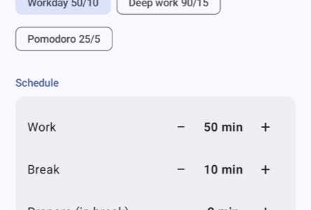

# Interval Timer

A low-power workday timer for Android (built for the Pixel 10 / Android 16): start it once in the
morning, put the phone away, and it runs **8 × (50 min work + 10 min break)** on its own.

- **Gong + vibration** at every transition (single gong → break, double → work, long → day done)
- **Setup is just the schedule** (presets 50:10, 90:15, 25:5) and alerts; everything else is
  decided while the timer runs
- **Breaks start with a 2-min prepare phase**; on the break screen you choose the activity
  (box breathing, meditation, NSDR, power nap, stretch, walk, eye reset, hydrate, ambient, silence)
  and can make it a **long break** (+10 min each tap, also from the notification); the rest of
  the day shifts later
- **Focus music** is picked on the work screen (brown noise, rain, ocean, singing bowls) and
  keeps playing with the screen off
- **Actionable notification** with countdown, Pause and Skip — no need to open the app
- **Restart-proof**: phases are absolute timestamps, rebuilt after reboot
- **Local-first**: settings and session go to Android's Google backup; no account, no analytics
- **Auto-update** from GitHub Releases

## Screenshots

| Setup | Work + focus music | Break · prepare | Box breathing |
|:-:|:-:|:-:|:-:|
|  |  |  |  |

| Dark: work | Dark: break | Phase-change notification | In-app update |
|:-:|:-:|:-:|:-:|
|  |  |  |  |

Light and dark follow the system theme, with Material You colours from the wallpaper.

## How it stays light

No background ticking. Each phase end is one `AlarmManager` exact alarm; the notification shows
a system-rendered countdown. A foreground service exists only while audio is playing.

## Resources

Audio is **not bundled in the APK**. [`resources/`](resources) holds the sounds and
`manifest.json`; the app downloads them from this repo on first launch and caches them offline.
Sounds are synthesized by [`tools/gen_sounds.py`](tools/gen_sounds.py). To add a sound, drop a file
in `resources/` and add an entry to `manifest.json` (`"loop": true` makes it selectable as music).

## Build & release

```bash
./gradlew testDebugUnitTest assembleDebug
scripts/release.sh 1.0.1 "What changed"
```

`release.sh` bumps `VERSION_NAME`, builds a signed APK, tags, pushes and creates the GitHub
release. The installed app checks `releases/latest` on launch, downloads a newer APK and offers
**Install**. Signing reads `IT_STORE_FILE`, `IT_STORE_PASSWORD`, `IT_KEY_ALIAS`, `IT_KEY_PASSWORD`
from `~/.gradle/gradle.properties`; the keystore stays out of git — **back it up**, every update
must be signed with the same key.
